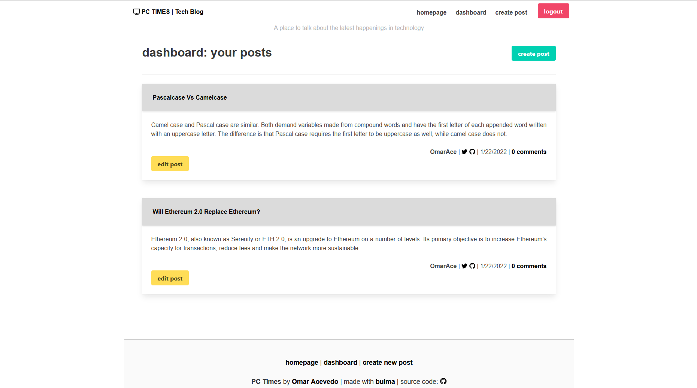

# Tech Blog

## Objective
Build a CMS-style blog website where prospective developers can write their thoughts and opinions on technology.

  ## Table of Contents 
- [Objective](#objective)
- [License](#license)
- [Description](#description)
- [Deployment](#deployment)
- [Questions](#questions)

## License

## Description

PC Times is a blog style website for all developers, new and experienced, to discuss new developments in technology or have discussions on certain aspects pertaining to technology.

## Deployment

https://pc-times.herokuapp.com/

### Built With

* [HTML](https://developer.mozilla.org/en-US/docs/Web/HTML)
* [CSS](https://developer.mozilla.org/en-US/docs/Web/CSS)
* [Bulma](https://bulma.io/)
* [Javascript](https://developer.mozilla.org/en-US/docs/Web/JavaScript)
* [Node.js](https://nodejs.org/en/)
* [Handlebars](https://handlebarsjs.com/)
* [DOTENV](https://www.npmjs.com/package/dotenv)
* [bcrypt](https://www.npmjs.com/package/bcrypt)
* [Express](https://www.npmjs.com/package/express)
* [Sequelize](https://sequelize.org/)

## Questions:

Have any questions?

Feel free to contact me at:
- Github: [OmarAce](https://github.com/OmarAce)
- Email: omarace95@gmail.com